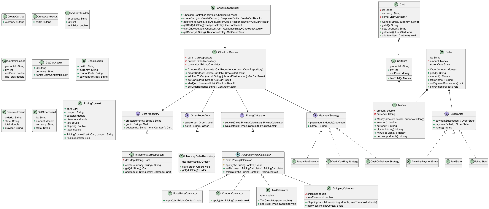
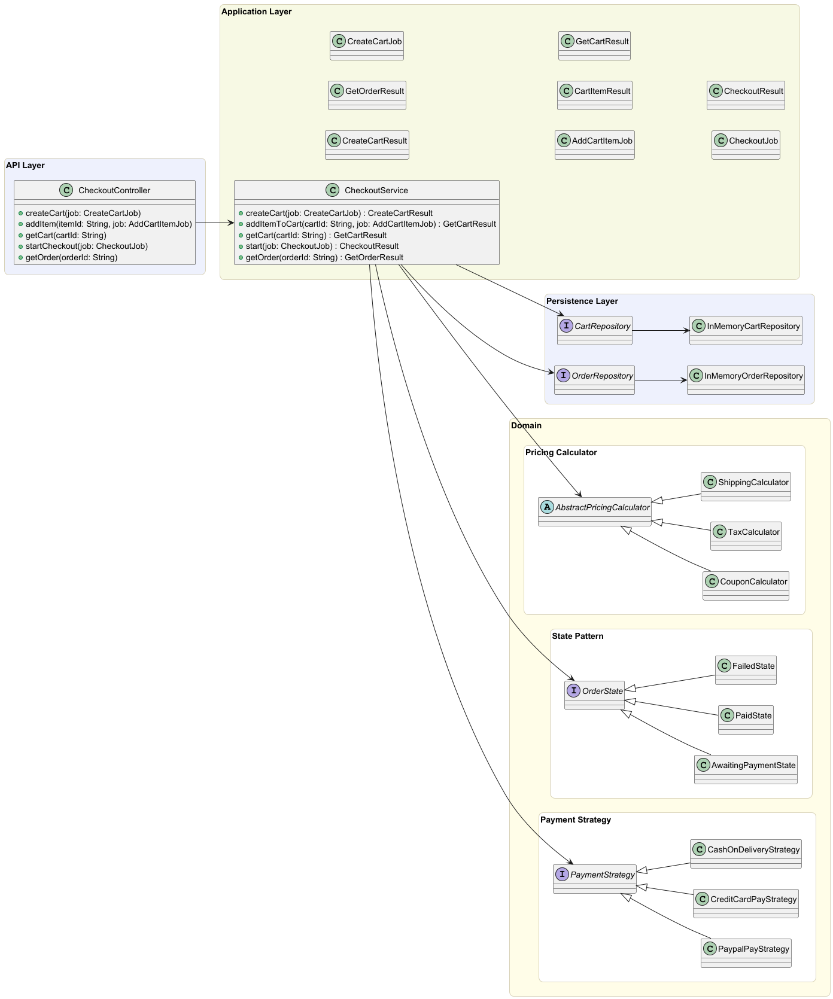
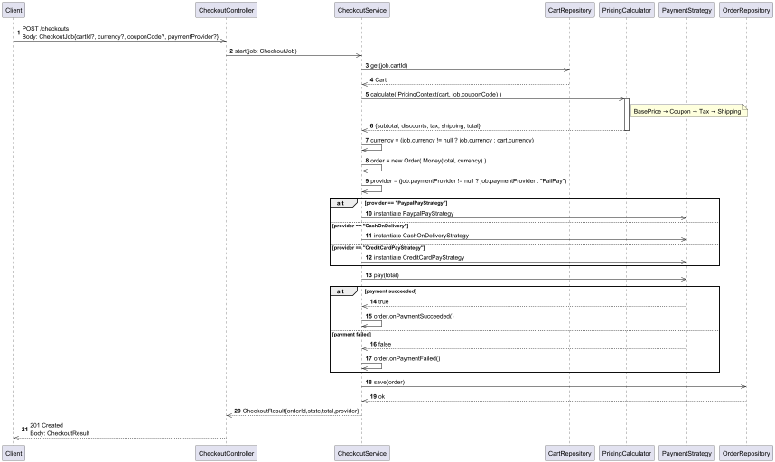
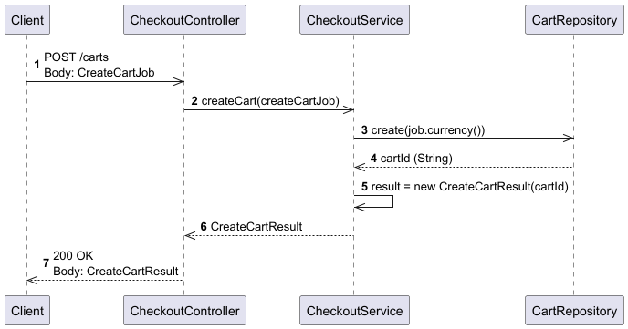
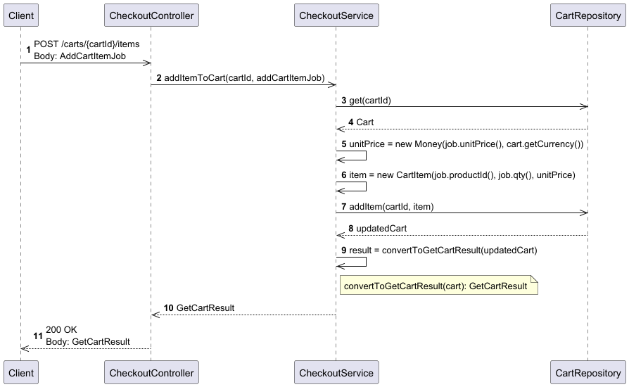
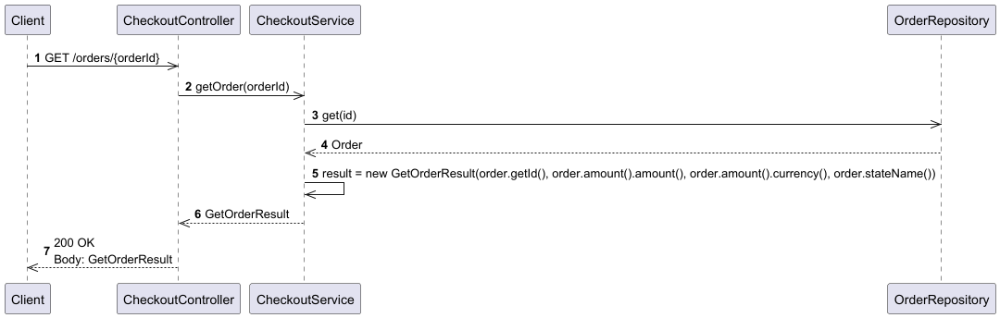
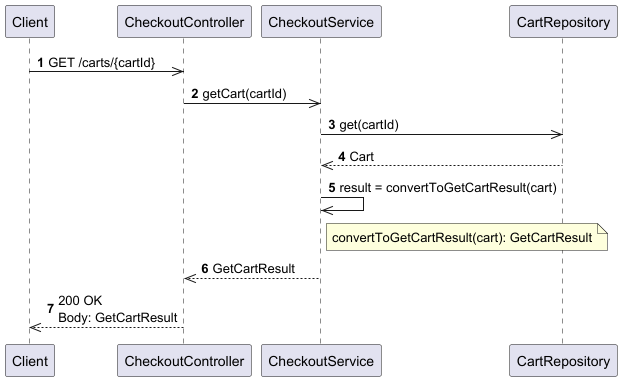

# Checkout API-first Service

---

## ❓ About
A lightweight **checkout service** built with **Java (Spring Boot)**, following clean architecture principles and documented with an **OpenAPI Specification**.  
It demonstrates a modular approach to cart, checkout, payment, and order management with in-memory persistence for easy demo and testing.

---

## ✨ Features
- **Cart Management** – create carts, add items, view contents
- **Checkout Flow** – compute totals with coupons, tax, shipping
- **Order Lifecycle** – track order states (`AwaitingPayment`, `Paid`, `Failed`)
- **Payment Providers** – configurable providers (`CreditCardPay`, `PaypalPay`, `CashOnDelivery`)
- **API-First** – documented with an **OpenAPI Specification (openapi.yaml)**
- **In-Memory Persistence** – quick demo setup, easily swappable for a database

---

## 📂 Project structure
```
📂 checkout-service/
├─ 📂 src/main/
│  ├─ 📂 java/com/checkoutservice/
│  │  ├─ 📂 api/             # API Layer (Controllers / REST endpoints)
│  │  ├─ 📂 app/             # Application Layer (Orchestration)
│  │  │  └─ 📂 beans/        # request/response models
│  │  ├─ 📂 domain/          # Core business logic
│  │  │  ├─ 📂 cart/
│  │  │  ├─ 📂 order/
│  │  │  ├─ 📂 pricing/
│  │  │  └─ 📂 payment/
│  │  └─ 📂 persistence/     # Persistance Layer (Infra / Repository contracts)
│  │
│  ├─ 📂 resources/
│  │  ├─ openapi.yaml         # API contract
│  │  └─ application.properties
│  
├─ pom.xml
└─ README.md
```

---

## 📦 Build and package
```
mvn clean package
```

---

## 💻 Launching the service
We need to launch the jar generated above.
```
java -jar target/checkout-service.jar
```
⚠️ Service is live at http://localhost:8080

---

## API Quickstart (How to demo - using curl) -- TO-DO fix this section
Example requests using cURL:
```
# 1. Create a cart
curl -X POST http://localhost:8080/carts \
  -H "Content-Type: application/json" \
  -d '{"currency":"USD"}'

# sample responce: { "cartId": "c_123" }
 
# 2. Add item
curl -X POST http://localhost:8080/carts/c_123/items \
  -H "Content-Type: application/json" \
  -d '{"productId":"prod-101","qty":2,"unitPrice":10.0}'

# 3. View Cart
curl http://localhost:8080/carts/c_123

# 4. Start checkout
curl -X POST http://localhost:8080/checkouts \
  -H "Content-Type: application/json" \
  -d '{"cartId":"c_123","currency":"USD","couponCode":"WELCOME10","paymentProvider":"MockPay"}'

# 4. Get order
curl http://localhost:8080/orders/o_456
```

---

## UML Diagrams

### 1) Class Diagram


### 2) Component / Layer Diagram


### 3) Sequence Diagram (Start Checkout)


### 4) Sequence Diagram (Create Cart)


### 5) Sequence Diagram (Add Item)


### 6) Sequence Diagram (Get Order)


### 7) Sequence Diagram (Get Cart)

